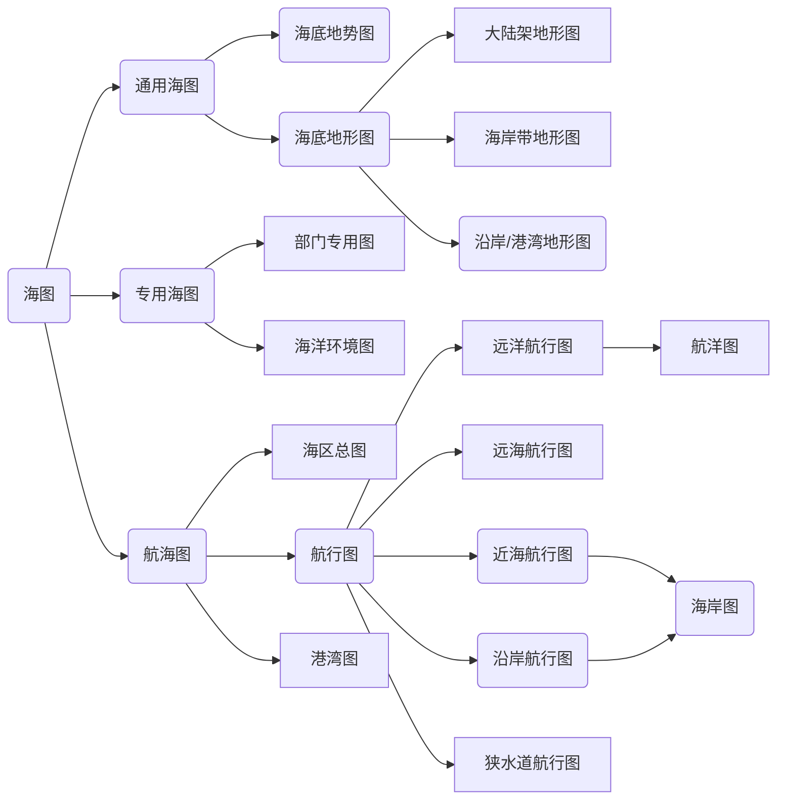

## 8.海图

考点：基本功能表现、特点、海洋 毗邻 陆地区域、墨卡托 等角

墨卡托投影 正轴、等角、圆柱

经线平行、纬线平行、经  、画图、相？？？

晕渲法、动线法、海图注记法、文字数字

---

>  海图六大要素包括什么很重要
>
> 根据用途海图分类
>
> 海图的数学投影墨卡托投影及其投影特点：等角航线，大地线在墨卡托投影上是什么样的
>
> 海底地貌的表示方法

---

重点

海图 特点、六大要素、等角航线、大地线、海图分类、用途有哪些、对地貌有哪些表示方式

---

考点1  海图的特点  

> 1. 海图的**描绘对象是海洋及其毗邻的陆地区域**的地形图。其六大要素为：海岸、海底地貌、航行障碍物、助航标志、水文及各种界限。
> 2. 海图的**表示方法**更具有与陆地地形图不同的特点。主要表现为：
>    	* 多选用墨卡托投影编制，等角航行，有利于海图作业
>    	* 没有定比例尺系列
>    	* 选用有1利于航海的特定的深度基准面
>    	* 分幅主要沿海岸线或航线划分
>    	* 特有的编号
>    	* 有自己的符号系统
>    	* 及时更新，保持其现势性，以确保航行安全。
> 3. 海洋**地形测量的常规方法**是利用船艇进行海洋水深测量；主要采用声学仪器和GNSS定位系统。

考点2  海图六大要素

> 1. 海岸
>
> 2. 海底地貌
>
> 3. 航行障碍物
>
> 4. 助航标志
>
> 5. 水文
>
> 6. 各种界限

考点3 按用途分类

考点4  **墨卡托投影（正轴等角**圆柱投影**）**

海图的数学投影墨卡托投影及其投影特点：等角航线，大地线在墨卡托投影上是什么样的？

①经线是相互平行的直线，而且相同度数间隔的经线之间的距离也相等。

②纬线也是平行的直线，相同度数的间隔随纬度的增大向两极逐渐伸长（渐长），至极地为无穷大。由于随纬度渐长的特点，又称它为渐长投影。

③经线与纬线成正交（相互垂直）。

④投影面上同一点的两方向线（大地线或大圆弧）的切线的夹角与实地一致。当比例尺较大时，方向线近似于直线。

⑤等角航线在投影平面上是一条直线，而大地线（椭球面上两点间最短距离）或大圆弧（把椭球体视为球体时）在投影平面上是一条凸向极地的曲线。 

考点5：海底地貌的表示方法

> 1. 符号法
> 2. 深度注记法
> 3. 等深线法
> 4. 分层设色法
> 5. 晕渲法

