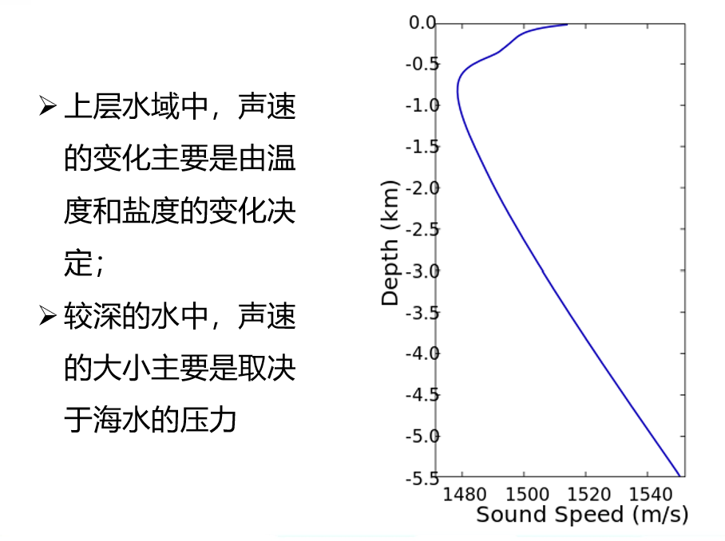

## 4.海洋声速及声线跟踪

**考点：声波在海水中传播特性、声速剖面、声道成因、特点；主动式声纳（目标）、被动式；声线跟踪概念及方法**

## 4.2.海洋声学

#### 4.1.2声速在海水中传播特性

0. Snell法则
   $$
   \frac{\sin{\theta}_1}{C_1}=\frac{\sin{\theta}_2}{C_2}
   $$
   

1. 声波在海水中衰减

   吸收、散射衰减、几何衰减

2. 声速
   $$
   C=\sqrt{\frac{K}{\rho}}
   $$
   声速测定：

   * 直接法：利用声速剖面仪
   * 间接法：经验公式（温度、盐度、压力）

3. 反射和折射

   海面、海底反射

   折射：

   ​	1. Snell 法则

    2. 声线：入射角**不等于0**，波束在界面处发生折射，若经历的水柱中有*N*+1个不同介质层，则产生*N*次折射，波束的实际传播路径为一个连续折线，即声线。

    3. 折射现象 

       > 原因：海水非均匀介质
       >
       > 声线向声速**减小**的方向弯曲
       >
       > 声线的弯曲程度和方向与**声速在垂直方向的变化**有关。声速变化愈大，弯曲越显著。
       >
       > 声波的传播速度在温水区要比冷水区快，且向**热水区？冷水区**（即声速较低的水区）弯曲
       >
       > 正常情况下，声线弯曲成**圆弧状**

   

声速剖面图

#### 4.1.3.声道

概念：声波在海洋中传播时，部分声能在海中某一层内而不溢出该水层。

成因：在深度方向声速极小处，声源发出的声线将向上和向下弯曲返回极值区，而保留在该水层上下两个声速相等的深度之间传播。

特点：由于在声道轴上下方的声速梯度的方向相反，按声波折射定律，声传播方向将凹向声道轴，故使声波部经过海面和海底的反射，而在声道中反复的传播

#### 4.1.4.海洋噪声

环境噪声

1. 海洋动力噪声：）

   风、海流、降雨、碎浪

2. 舰艇噪声

## 4.2.声纳及其工作方式

**考点：流程、目标**

主动式：

> 流程：
>
> 	1. 发射系统发射携带一定信息的声信号（发射信号），
> 	1. 在海水中遇到障碍物，产生回声信号；
>
> 3. 在某一方向的回声信号传到接受基阵，并将其转化为电信号，经处理器处理后送到判决器，
>
> 4. 根据预先确定的原则进行判决，最后显示判决结果哦。
>
>    声纳目标：潜艇、水雷、鱼雷、冰山、暗礁
>
>    

被动式：

> 流程：
>
> 被动式通过接收被探测目标（声源部分）如鱼雷、潜艇等的辐射噪声，来实现水下目标探测。
>
> 声纳目标：潜艇、鱼雷等

## 4.4.声线跟踪

**考点：声线跟踪概念、方法**

概念：是建立声速剖面图基础上的一种波束脚印（投射点）相对船体坐标系坐标的计算方法。

方法（层追加法）：

1. 基于层内常声速下的声线跟踪
2. 基于层内常梯度下的声线跟踪

