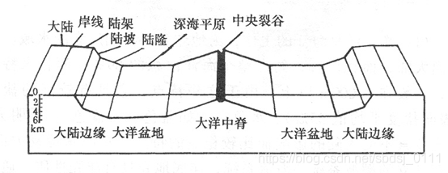
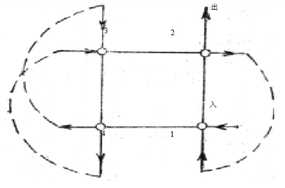
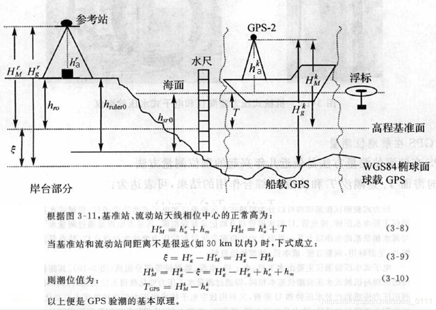
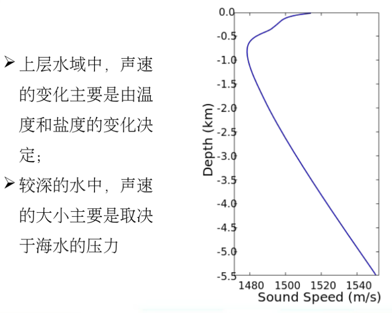
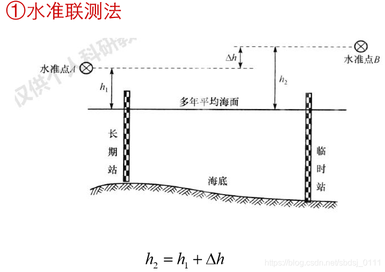
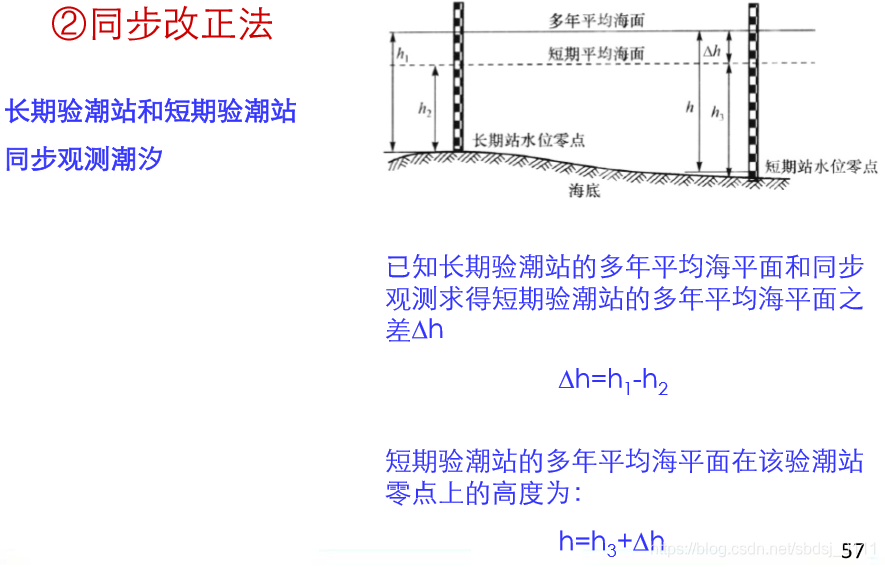
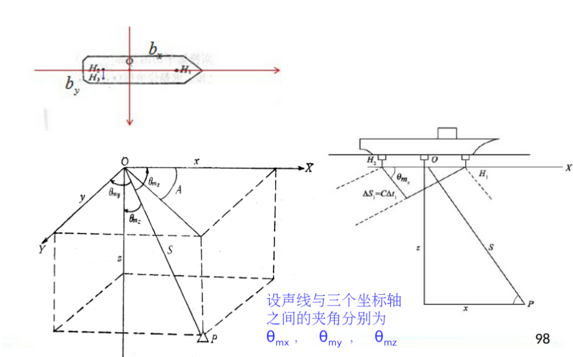

# 海洋测绘

# 第一章

*中国近海情况，海洋法公约10分。*

*第四页：海洋地形*

*第九页：世界海洋新格局，海洋法公约*

*第十、十一页：中国近海情况：渤海东南黄海南海以及南海的扩充*

*第十五页：海洋测量的特点*

*第十七页：海洋测量工作包括哪些内容*

**海洋地形**

分为海岸带、大陆边缘和大洋底。能从图中看出哪个地方是什么

##### 世界海洋新格局，海洋法公约

领海基线为沿海国家测算领海宽度的起算线。基线内向陆地一侧的水域称为内水，向海的一侧依次是领海、毗邻区、专属经济区、大陆架等管辖海域。

内海（内水）：领海基线以内的水域

领海：领海基线起不超过12**海里**

毗邻区：从领海基线起不超过**24海里**

大陆专属经济区：**200海里**

大陆架：不到200的到200，超过200的到350或不超过2500m等深线100

##### 中国近海情况

渤海：

半封闭内海，可分为五个部分，坡度平缓，是一个近封闭的浅海，平均深18

黄海：

半封闭的陆架浅海，山东半岛的成头山与朝鲜半岛长山串将其分为北黄海（38）和南黄海（46）

东海：

太平洋边缘海，西北黄海，东北从济州岛至五岛列岛与朝鲜海峡为界，东面以琉球群岛与太平洋相连，南面自福建东山岛至台湾南端与南海相通，平均深349

南海：

南海东北经台湾海峡与东海相通，东面接菲律宾。。。与太平洋分隔，南面接马来半岛。。。与印度洋分隔，由周边向中心有较大坡降的菱形海盆，平均深1212

南沙群岛：

北起[雄南礁](https://baike.baidu.com/item/雄南礁)，南至[曾母暗沙](https://baike.baidu.com/item/曾母暗沙)，西为[万安滩](https://baike.baidu.com/item/万安滩)，东为[海马滩](https://baike.baidu.com/item/海马滩)，距离大陆最远的是曾母暗沙，南沙群岛西北越南，东北菲律宾，南部马来西亚、文莱、印度尼西亚

在已命名的岛礁滩沙中，岛屿有[太平岛](https://baike.baidu.com/item/太平岛)、[中业岛](https://baike.baidu.com/item/中业岛)、[西月岛](https://baike.baidu.com/item/西月岛)、[南威岛](https://baike.baidu.com/item/南威岛)、[北子岛](https://baike.baidu.com/item/北子岛)、[南子岛](https://baike.baidu.com/item/南子岛)、[鸿庥岛](https://baike.baidu.com/item/鸿庥岛)、[南钥岛](https://baike.baidu.com/item/南钥岛)、[马欢岛](https://baike.baidu.com/item/马欢岛)、[费信岛](https://baike.baidu.com/item/费信岛)和[景宏岛](https://baike.baidu.com/item/景宏岛)等11座，其中最大的岛屿是太平岛面积0.432平方公里，最高的是北子岛顶部海拔12.5米；沙洲有[敦谦沙洲](https://baike.baidu.com/item/敦谦沙洲)、[安波沙洲](https://baike.baidu.com/item/安波沙洲)、[双黄沙洲](https://baike.baidu.com/item/双黄沙洲)、[染青沙洲](https://baike.baidu.com/item/染青沙洲)、[北外沙洲](https://baike.baidu.com/item/北外沙洲)和[杨信沙洲](https://baike.baidu.com/item/杨信沙洲)等6座

海洋测绘的特点
 垂直坐标（船体之下的深度）和平面位置同步测定；
 海底控制点的距离相隔较远；
 动态测量，观测时间长，精度低；
 声波，作为信号源；
 测深并进行测深改正；
 无法进行重复观测，须同步观测。

##### 海洋测量工作包括哪些内容

海洋重力测量

海洋磁力测量

海水面的测定

大地控制和海底控制测量

定位

测深

海底地形测量及地貌、底质探测

海图编制

海洋地理信息系统（MGIS）

 

# 第二章

*海洋控制网的组成*

*海底控制点的结构*

*P32，主动式水声照准标志，水下应答器，补偿*

*P34，水声声标的有效距离，有效距离的概念*

*海底控制测量的几何图形：正方形，三角形，三角形比正方形所用控制点少*

*2.5节，海底控制点的定标，什么叫海底控制点的定标，海底控制点的定标主要做哪些工作*

*主要掌握深度的测定方法*

##### 海面控制网的组成

海面控制网主要包括以固定浮标为控制点的控制网、海岸控制网、岛屿控制网以及岛屿—陆地控制网

##### 海面控制点的结构

采用的几何图形与陆上大地网基本相同，如三角形、 四边形、中点多边形

按片形或锁形两种方式布设

基本点（100-1000，0.5）、加密点（2-30，1~2）、临时点（<=2，5~10）

##### 主动式水声照准标志，水下应答器，补偿

它能主动发射出强度足以保证测量船上的水声设备能在其有效作用距离内接收到该信号；或者当接收到船台发射出的询问声信号后，能转发不同频率的应答声信号被船台接收。

水声应答器，通常由换能器、电子系统（包括电源）、锚以及浮标等组成。

##### 被动式水声照准标志

提高被动式照准标志的目标强度，应考虑下列因素：

**入射声信号所具有的声功率；**

**入射声信号的方向性，当位于入射声波波阵面的法线方向时，显然它具有最大的声能；**

**被动式水声照准标志的材料结构和形状。**

##### 水声声标的有效距离，有效距离的概念

水声声标的有效距离，即声信号的最大传播距离。这里的有效距离，指的是有效水平距离。

影响水声声标有效距离的因素：
 **（1）声信号的发射强度和频率；**
 **（2）声信号传播路径中噪声的掩盖作用；**
 **（3）声信号传播过程中的衰减；**
 **（4）声射线的折射特性。**

##### 海底控制测量的几何图形：正方形，三角形。三角形比正方形所用控制点少，一般以等边三角形布设海底控制网点

当利用坐标已知的海底控制点来确定测量船位时，须满足二个条件:
 1.测量船必须位于作为海底控制点的水声声标的有效范围之内;
 2.需要三个这样的控制点实施定位。

##### 2.5节，海底控制点的定标，什么叫海底控制点的定标，海底控制点的定标主要做哪些工作主要掌握深度的测定方法

**海底控制点定标的作用是验证是否符合布网方案要求，得出控制点之间的相对位置（或者说控制点在局部坐标系中的位置）；内容包括海底控制点深度的测定、海底控制点间距离的测量、海底控制点（网）方位的测定。（参照测量学的测量要素：高程、距离、角度）**

海底控制点的深度，指的是声标在平均海面下的深度。深度测定一般采用回声测深仪。采用三叶法测定，保证每个控制点经过两次，一般测三个测回。要记录水深测量时刻，为了计算水位改正。

在海上，由于考虑的因素比较多，使用国家高程基准的情形要复杂得多。例如，在近岸和大陆架海区进行海底地形测量，通常需采用与陆地统一的高程基准。而在其他情况下均采用所谓深度基准面。深度基准面即海图所载水深的起算面，又称海图基准面。

 

## 第三章

*海洋的水文要素*

*主要掌握海水温度的测定的仪器，包括表层和深层，以及仪器有哪些和仪器是如何测定水温的*

*掌握海水温度随深度变化的大致规律*

*3.5节潮汐和潮汐观测：潮汐的概念、类型（全日潮，半日潮，混合潮）*

*3.5.2潮汐观测：潮汐观测的几种方法，每种方法的精度及适用于哪种验潮站*

*GPS验潮的原理*

*3.6节：P64，海洋波动类型及其影响，海浪对于船只的影响以及如何消除海浪对测量工作的影响*

**盐度**

光学测定盐度法

比重测定法

声学测定盐度法

电导率测定盐度法

##### 主要掌握海水温度的测定的仪器，包括表层和深层，以及仪器有哪些和仪器是如何测定水温的

表层水温观测方法：

> 直接测量方法常用仪器：海水表面温度计、电测表面温度计、其他的测温仪器

> 用水桶提取海水，再用精密温度计测定水温。

> 卫星上通常利用红外辐射温度计测定海洋水温。

> 在海洋浮标上一般装有自记测温仪器，记录所在位置的温度 。

深层水温观测方法：

> 主要采用的仪器：深水温度计；颠倒温度计；温盐深自记仪器 ；投弃式温深仪等。

> 实际测量中，温度是以国际温标为依据，国际符号为 T（热力学温度）或t （摄氏温度℃）；一般以摄氏温度表示。

**测定步骤：**

1. 表层水温的测定

   将水温计投入水种至待测深度，感温5min，迅速上提读数。从离开水面至读数完毕不应超过 20s，将筒内水倒净。

2. 水深 40m 以内水温的测定

   将深水温度计投入水中，同表层。

3. 40m 以上的水温的测定

   将安装有闭端式颠倒温度计的颠倒采水器，投入水中至待测深度，感温 10min 后，由“使锤”作用，打击采水器的“撞击开关”，使采水器完成颠倒动作。

**掌握海水温度随深度变化的大致规律**

 

**3.5节潮汐和潮汐观测：潮汐的概念、类型（全日潮，半日潮，混合潮）**

月中天：月球经过某地子午线圈的时刻

受月球和太阳吸引力的作用，海水产生一种规律性的升降运动，称之为海洋潮汐

产生潮汐现象的主要原因是：地球上各点距离月球和太阳的相对位置不同引起海面升降

每月两次大潮：朔（初一）和望（初十五）之后两三天

每月两次小潮：上弦（初八）和下弦（初二十二、二十三）之后两三天

月球赤纬最大时为回归潮

月球赤纬最小时为分点潮

**太阴日**:月球中心连续两次通过地球上同一子午线所需要的时间，约24h50min

[名词解释：半日潮、日潮、混合潮_低潮 (sohu.com)](https://www.sohu.com/a/275770401_825098)

**半日潮（semi-diurnal tide）**，在一个太阴日（约24小时50分）内发生两次高潮和两次低潮。相邻两次高潮和两次低潮高度大致相等，涨潮历时和落潮历时大致相等。

**日潮（diurnal tide）**，在半个月中有8天以上出现一次高潮和一次低潮。潮位曲线为对称的余弦曲线。当月球赤纬接近零时，潮位涨落不明显，赤纬增大时，潮位涨落也随之增大，赤纬最大，潮差也最大。

**混合潮（mixed tide）**，混合潮可分为不规则半日潮和不规则日潮。不规则半日潮——两次高低潮，潮差不同，历时不同。 不规则日潮，在半个月中，一个太阴日里出现一次高潮一次低潮的天数不超过七天。而在其余日子里，一个太阴日仍出现两次高潮两次低潮

**3.5.2潮汐观测：潮汐观测的几种方法，每种方法的精度及适用于哪种验潮站**

水尺验潮：精度低，为10-15cm，唯一一个滤波性能不好的

井式自记验潮仪式：适用于长期的，高精度的观测，测井消除海面浮动对浮筒的影响，成本高，机动性差

压力式验潮仪：精度高

超声波潮汐计：通过检测回波得到海面随时间的变化或者水深值，安置在空气中的精度更高

**平均海平面**：某一海域一定时期内海水面的平均值

**深度基准面**：定义在当地稳定平均海平面之下，使得瞬时海平面可以，但很少低于该平面。既要保证船安全，又考虑航道利用率

L：基本分潮叠加之后相对于潮汐平均海平面的最低值。深度基准面通常取在**当地多年平均海面**下深度为L的位置

**GPS验潮的原理**：**GPS载波相位差分测量技术作为定位基础，利用大地高反算潮位。**

**根据载体的不同分为船载和浮标GPS验潮**

要能画出来这个图

****

1956黄海平均海平面1985国家高程基准面

**3.6节：P64，海洋波动类型及其影响，海浪对于船只的影响以及如何消除海浪对测量工作的影响**

影响：波浪使得测量船产生横纵摇、升沉运动。

消除：波浪补偿仪和姿态

# 第四章

*海洋声速及声线跟踪*

*4.1.2节，好好看课本，P78，声波在海水中的传播特性，要能知道声速剖面大致是什么样的*

*4.1.3节，大洋声道的成因、特点*

*4.2节，声纳及其工作方式：主动的工作流程及适用于探测什么样的目标及被动的工作流程及适用于探测什么样的目标*

*4.4节，声线跟踪，P90，声线跟踪的概念，通常采用的方法：层追加的方法，知道有两种假设方法：呈直线的，成梯度的*

## 4.海洋声速及声线跟踪

**考点：声波在海水中传播特性、声速剖面、声道成因、特点；主动式声纳（目标）、被动式；声线跟踪概念及方法**

## 4.2.海洋声学

#### 4.1.2声速在海水中传播特性

0. Snell法则
   $$
   \frac{\sin{\theta}_1}{C_1}=\frac{\sin{\theta}_2}{C_2}=ρ
   $$

1. 声波在海水中衰减

   吸收、散射衰减、几何衰减

2. 声速
   $$
   C=\sqrt{\frac{K}{\rho}}
   $$
   声速测定：

   * 直接法：利用声速剖面仪
   * 间接法：经验公式（温度、盐度、压力）

3. 反射和折射

   海面、海底反射

   折射：

   1. Snell 法则

    2. 声线：入射角**不等于0**，波束在界面处发生折射，若经历的水柱中有*N*+1个不同介质层，则产生*N*次折射，波束的实际传播路径为一个连续折线，即声线。

    3. 折射现象 

       > 原因：海水非均匀介质
       >
       > 声线向声速**减小**的方向弯曲
       >
       > 声线的弯曲程度和方向与**声速在垂直方向的变化**有关。声速变化愈大，弯曲越显著。
       >
       > 声波的传播速度在温水区要比冷水区快，且向**冷水区**（即声速较低的水区）弯曲
       >
       > 正常情况下，声线弯曲成**圆弧状**

   

声速剖面图

#### 4.1.3.声道

概念：声波在海洋中传播时，部分声能在海中某一层内而不溢出该水层。

成因：在深度方向声速极小处，声源发出的声线将向上和向下弯曲返回极值区，而保留在该水层上下两个声速相等的深度之间传播。

特点：由于在声道轴上下方的声速梯度的方向相反，按声波折射定律，声传播方向将凹向声道轴（声速分布在极小值深度处的水平线），故使声波部经过海面和海底的反射，而在声道中反复的传播

#### 4.1.4.海洋噪声

环境噪声

1. 海洋动力噪声：

   风、海流、降雨、碎浪

2. 舰艇噪声

## 4.2.声纳及其工作方式

换能器：分为发射和接受换能器（水听器）

应答器：既能接受又能发射，也能作为海底控制点的照准标志，即水声声标

**考点：流程、目标**

主动式：

> 流程：
>
> 1. 发射系统发射携带一定信息的声信号（发射信号），
> 2. 在海水中遇到障碍物，产生回声信号；
> 2. 在某一方向的回声信号传到接受基阵，并将其转化为电信号，经处理器处理后送到判决器，
> 2. 根据预先确定的原则进行判决，最后显示判决结果。
>
> 声纳目标：潜艇、水雷、鱼雷、冰山、暗礁
>
> 

被动式：

> 流程：
>
> 被动式通过接收被探测目标（声源部分）如鱼雷、潜艇等的辐射噪声，来实现水下目标探测。
>
> 声纳目标：潜艇、鱼雷等

## 4.4.声线跟踪

**考点：声线跟踪概念、方法**

概念：是建立声速剖面图基础上的一种波束脚印（投射点）相对船体坐标系坐标的计算方法。

方法（层追加法）：

1. 基于层内常声速下的声线跟踪

2. 基于层内常梯度下的声线跟踪

   常声速/常梯度-声线跟踪法；等效声速剖面法：误差修正法、等效声速

# 第五章

*潮汐调和分析*

*P111，深度基准，理论深度基准面的计算大致是什么样的过程*

*短期焉潮站，深度基准面如何确定，掌握水准联测法和同步改正法*

5.潮汐观测和深度基准

**考点：(P111) 深度基准面确定的原则、理论深度基准面计算流程；（P115）5.4.1短期验潮站平均海平面的确定中水准联测法及同步改正法**

### 5.3垂直基准

**考点：原则、理论计算流程**

垂直基准分为高程基准和深度基准

深度基准面确定的原则：

1. 考虑舰船航行安全
2. 照顾到航道利用率

理论深度基准面的计算流程：

依据潮汐调和常数计算理论最低潮面。

基本计算原理：由 XXXXXX 八个主要分潮（4个全日分潮、4个半日分潮）叠加计算相对于潮汐振动平均位置（长期平均海平面）可能出现的最低水位，并附加考虑3个浅海分潮及2个长周期分潮的贡献。

L：基本分潮叠加之后相对于潮汐平均海平面的最低值。深度基准面通常取在**当地多年平均海面**下深度为L的位置

### 5.4.深度基准面的具体确定

考点：短期验潮站平均海平面的确定：水准联测法、同步改正法

水准联测法：

同步改正法：

​	

# 第六章

*不同定位的精度水平*

*我国沿岸海区渔民用的定位技术*

*6.6水声定位的基本原理和方法：换能器，水听器（接收换能器），应答器（水声声标）的概念*

*水声定位系统采取的定位方式及定位原理*

*短基线长基线原理及优缺点*

**不同定位的精度水平**

天文定位

光学定位：前后方交会、极坐标

地基无线电定位：分类按作用距离、电信号参量、几何参量、工作方式

塔康系统（TACAN）、罗兰-C系统（Loran-C）

**空基无线电定位**：

GPS、GLONASS、BDS、Galileo

由空间部分、地面控制部分、用户设备部分构成

地面控制部分：一个主控站（编制导航电文），三个注入站（将导航电文注入GPS卫星），五个监测站（后有增加，接收卫星数据传给主控站）

GPS单点定位方法的实质是空间距离后方交会 

|              | SPP（标准单点定位） | PPP（精密单点定位）      |
| ------------ | ------------------- | ------------------------ |
| 观测值       | 伪距观测值，精度3m  | 载波相位观测值，精度cm级 |
| 卫星位置计算 | 广播星历            | 精密星历                 |
| 卫星钟差计算 | 广播星历            | 精密星历                 |
| 电离层误差   | 模型改正            | 双拼改正                 |
| 对流层误差   | 模型改正            | 模型+参数估计            |
| 其他误差     | 不考虑              |                          |

相对定位又称为差分定位，单差（站间）双差（站间、星间）三差（站间、星间、历元间）

**水声定位**

定位方式：

测距定位（往返时间差—>距离S—>水平距离D，或者两个S双圆交会）

测向定位（使两个水听器接收到的信号相位差为0）

**换能器：发射信号**

**水听器：接收信号**

**应答器：发射和接受信号（水声声标）**

**我国沿岸海区渔民用的定位技术**：

超短基线

**水声定位系统**

应答器之间的距离构成基线

超短基线（<10cm）船底水听器阵列按直角/等边三角形布设而装在一个很小的壳体内

短基线（20~50m）在船底安置**一个水听器基阵**，水下部分仅需要**一个应答器**

方位——方位法，水深Z已知
$$
\frac{\cos{\theta}_mx}{\cos{\theta}_mz}*Z=y
$$

$$
\frac{\cos{\theta}_mx}{\cos{\theta}_my}*Z=y
$$
方位——距离法

长基线（100~6000m）基线长度在百米到几千米之间，三个应答器定位，通过空间交会得到船位

| 基线     | 优点                       | 缺点                                    |
| -------- | -------------------------- | --------------------------------------- |
| 长基线   | 设备昂贵，布设和回收时间长 | 精度高                                  |
| 短基线   | 价格低廉，操作简单         | 距离越远误差越大，深水时基线一般大于40m |
| 超短基线 | 比短基线精度更高           | 系统安装后的校准困难                    |

# 第七章

*7.2回声测深原理，回声测深仪器的组成，总改正数的求取方法*

*7.4多波束测深系统，系统组成，各个组成部分的作用*

*P162，多波束测深数据处理，波束脚印，波束在海底位置投射点计算的四个步骤，每一步是在做什么*

*7.8节，P173掌握测深线的分类，如何进行布设，方向布设的基本原则*

*7.9节，测深精度的影响因素有哪些*

*7.10节，水位改正的定义，五种方法，前提假设，基本原理*

** 

*选择（填空）论述，画图（深度基准面），计算，比如短期基站和深度基准面*

 ## 7.水深测量及海底地形测量

考点：

* 7.2 回声测深原理：组成、总改正数求取方法

* 7.4 多波束测深系统组成及各部分作用; 多波束测深数据处理，波束脚印、计算波束脚印在海底位置四个步骤
* 7.8 测线布设的主要考虑因素，布设及基本原则，测深线分类
* 7.9 测深精度的影响因素
* 7.10 水位改正的定义，五种方法（前提假设、基本原理）

### 7.2.回声测深原理

考点1  回声测深仪组成：

> 发射机、接收机、发射换能器、接收换能器、显示设备、电源部分

$$
原理：H=\frac{1}{2}Ct
$$

考点2  总改正数求取方法：

> 1. 水文资料法（超过20m）：吃水改正、转速改正、声速改正（影响最大、深度比对法、声波速度计直接测定、间接法）
>
> 2. 校对法（小于20m水深测量）：将水听器、检查版至于换能器以下 H 深度处，与当时当地实际深度比较，取差值作为测深仪改正数
>

### 7.4.多波束测深系统

考点1  多波束测深系统组成及各部分作用：

> 组成：多波束声学系统、多波束数据采集系统、数据处理系统、外围辅助传感器。
>
> 各部分作用：
>
> * 多波束声学系统：换能器，负责波束的发射与接收
> * 多波束数据采集系统：波束形成、将接收到的波束转化为数字信号, 反算测量距离或往返程时间
> * **外围辅助传感器（定位传感器、姿态传感器、电罗经、声速剖面仪）：定位、船姿、航向、海水中声速传播特性**
> * 数据处理系统：计算波束投射点坐标和深度

考点2  多波束测深数据处理，计算波束脚印在海底位置的四个步骤

> 1. 姿态改正（横摇）
>
> 2. 船体坐标系下波束投射点位置的计算
> 3. 波束投射点地理坐标的计算
> 4. 波束投射点高程的计算

### 7.8.测线布设

准备工作：1. 测深水域的确定；2. 测深线的布设； 3. 测深的导标放样

考点1  测线布设的主要考虑因素

> 1. 测深线的深隔：主测线图上10mm 或 先确定实地间隔，再取其图上间隔6、8、10 mm ，最后确定比例尺......
>
>    测深密度：同一测深线上水深点之间所取的间隔。
>
> 
>
> 2. 测深线的方向：
>
>    > * 测深线的布设方向：
>    >
>    >   	* 测深线垂直于水流方向（测深线通过地貌变化比较距剧烈和有代表性的地方）
>    >   	* 测深线与水流轴线成 45°（斜距大于平距）
>    >   	* 测深线成辐射线方向（岛屿延伸、岛屿周围水域）
>    >
>    > * 布设方向基本原则：
>    >
>    >   1. 有利于完整显示海底地貌
>    >
>    >   2. 有利于发现航行障碍物
>    >
>    >   3. 有利于工作

考点2  测线分类及布设原则

> 分类：
>
>  1. 主测深线
>
>     一般主测深线间隔为图上 10 mm，重要\复杂海区, 主测深线间隔适当缩小；
>
>  2. 检查测线
>
>     与主测深线垂直；
>
>     检查定位、测深和水位改正等误差
>
>  3. 补充测线
>
>     在主测深线之间局部加密；加密测深线间隔为主的1/2或1/4

### 7.9.测深精度

考点1  测深精度的影响因素\测深的误差

> 1. 与声信号传播相关的声速误差
> 2. 测深和定位仪器自身的误差
> 3. 潮汐测量与模型误差
> 4. 换能器安装不正确引起的定位误差
> 5. 船只航向与船摇误差
> 6. 船只运动传感器的精度
> 7. 数据处理误差

### 7.10.水位改正定义、五种方法（前提假设、基本原理）

考点1  水位改正定义

> 水位改正目的是尽量消除测深数据种潮汐的影响，将测深数据转化为以当地深度基准面为基准的水深数据。

考点2  水位改正五种方法

> 1. 单站水位改正法:
>
>    * 前提范围：测区不大时，测区处于验潮站的有效范围内，可用水位资料进行改正。
>    * 基本原理：
>      1. 图解法：绘制水位图，横坐标为时间，纵坐标为水位改正数，求得任意时刻水位改正数
>      2. 解析法：以观测数据为采样点进行多项式内插（抛物线插值、二次样条插值）
>
> 2. 线性内插法：
>
>    * 范围：当测区位于A、B两个验潮站之间，且超过两站有效范围。
>
>    * 前提假设：两站之间的瞬时海面为直线形态。
>
>    * 基本原理：根据A、B两站的观测资料，对控制不到的区域线性插值。
>
> 3. 水位分带改正法：
>
>    * 范围：测区范围较大时，用一个站的水位不能控制整个测区时，可采用两个站的水位资料进行水位分带改正。
>
>    * 原理：两站之间潮波均匀。同相潮时和同相潮高的变化与其距离成正比例。
>
>    * 分带的界限方向与潮波传播方向垂直
>
>    * 两验潮站之间的水位分带数由下式确定：
>      $$
>      K=\frac{\Delta \xi}{\Delta z}
>      $$
>
>      * K为分带数
>
>      * $\Delta \xi$ 为两验潮站深度基准面重叠时，同一时刻两验潮站间的最大水位差
>
>      * $\Delta z $ 为测深精度
>
> 
>
> 
>
> 4. 潮时差法
>
>    前提：假设两个验潮站之间的潮时差和潮高于距离成正比/两站之间潮波均匀。潮时和潮高的变化与其距离成正比例。
>
>    解算过程：
>
>    1. 求解潮时差(两个验潮站的水位信号相似时的时差叫做浪时差)
>    2. 求解任意点水位改正数
>
> 5. 参数法
